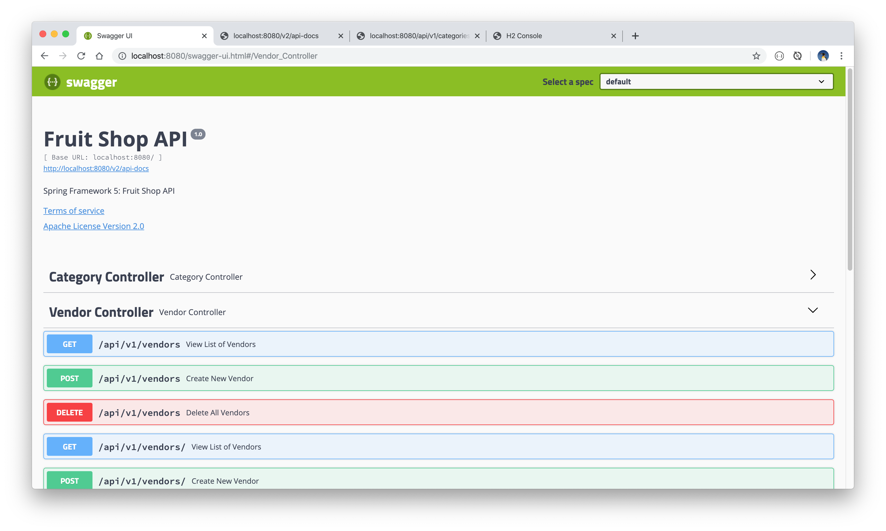

# Fruit Shop API
[](https://circleci.com/gh/Carla-de-Beer/fruit-shop-api)

A Spring Boot RESTful API modelled after the http://predic8.de API example, executing the standard set of CRUD operations on a set of data around the concept of a fruit shop.

The project allows for connection to either an H2 database (default), or a MySQL database. To change these, comment/uncomment the relevant application properties yml files.

To generate the MySQL database, tables and users, follow the SQL queries inside the file `src/main/scripts/configure-mysql.sql`. For the H2 database, initial data is read in via the `Bootstrap` class.

Unit tests are written with JUnit 5 and continuous integration testing is done through [CircleCi 2.0](https://circleci.com/docs/2.0/).

## Requirements

* Java 11
* Spring Boot 2.2.1
* Maven 3.6.1
* H2/MySQL 8.0.18
* JUnit 5

## Getting started

* Fork or clone the project.
* Start the project server by running the command `mvn spring-boot:run`.
* The API can be called with any of the following cURL CRUD-based requests:

  * GET/READ (in either JSON or XML formats):

    * ```curl -X GET --header 'Accept: application/json' 'http://localhost:8080/api/v1/categories/'```
    * ```curl -X GET --header 'Accept: application/xml' 'http://localhost:8080/api/v1/categories/'```
    * ```curl -X GET --header 'Accept: application/json' 'http://localhost:8080/api/v1/vendors/'```
    * ```curl -X GET --header 'Accept: application/xml' 'http://localhost:8080/api/v1/vendors/'```

  * CREATE/ADD:

    * ```curl -X POST --header 'Content-Type: application/json' --header 'Accept: application/json' -d '{"name": "test"}' 'http://localhost:8080/api/v1/categories/'```
    * ```curl -X POST --header 'Content-Type: application/json' --header 'Accept: application/json' -d '{"name": "test"}' ''http://localhost:8080/api/v1/vendors/'```

## API Documentation

API documentation is provided by means of Swagger2, which can be opened in the browser with the following urls:

* http://localhost:8080/v2/api-docs
* http://localhost:8080/swagger-ui.html#/

<p align="center">
  
</p>